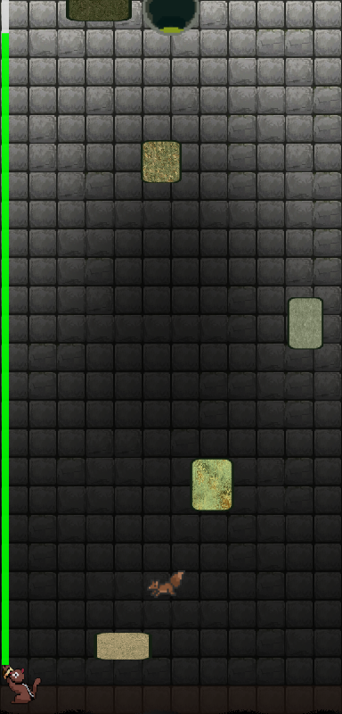
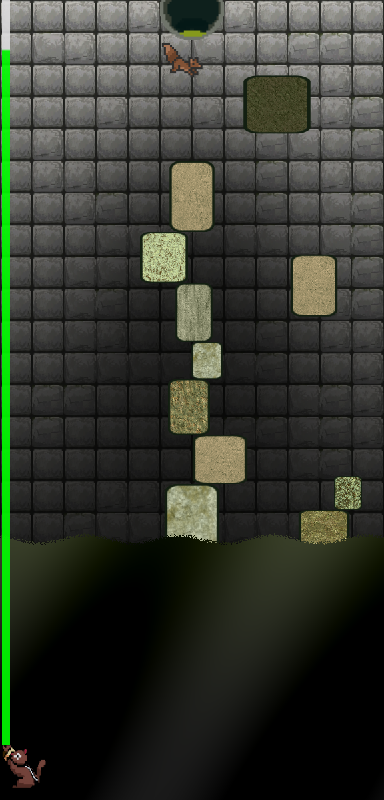
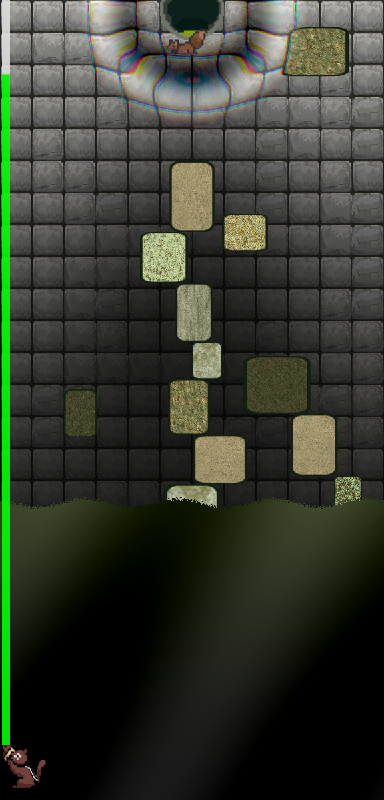
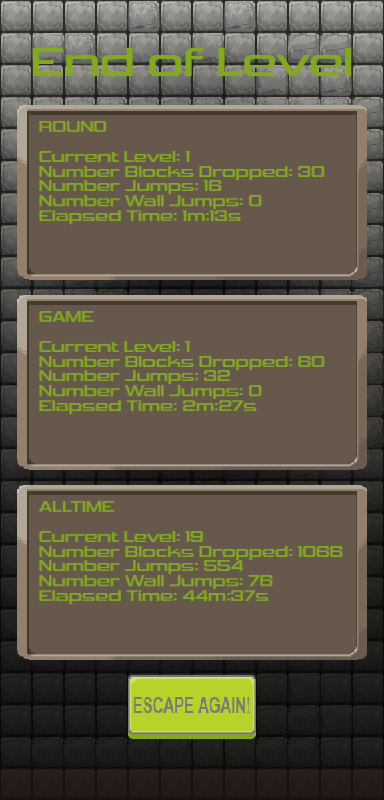

[](https://creativecommons.org/licenses/by/4.0/)

# Falling Block — Game Jam 2025

A platformer game built using **ExcaliburJS** for the Falling Block Game Jam 2025.  
Jump, run, and dodge your way through falling blocks and challenging obstacles!

---

## Table of Contents

- [Demo / Itch.io Page](#demo--itchio-page)
- [Features](#features)
- [Screenshots](#screenshots)
- [Getting Started](#getting-started)
  - [Prerequisites](#prerequisites)
  - [Installation](#installation)
  - [Running Locally](#running-locally)
- [Project Structure](#project-structure)
- [How to Play](#how-to-play)
- [Known Issues & TODOs](#known-issues--todos)
- [Contributing](#contributing)
- [License](#license)

---

## Demo / Itch.io Page

[\[Link to Game\]](https://mookie4242.itch.io/escape-the-well)

---

## Features

- Platformer gameplay with physics, jumping, and obstacles
- Falling blocks that create dynamic hazards
- Multiple levels or stages (if applicable)
- Responsive controls
- Designed & built within the Game Jam timeframe

---

## Screenshots







---

## Getting Started

### Prerequisites

Make sure you have:

- [Node.js](https://nodejs.org/) (v16+ recommended)
- npm or yarn
- A web browser that supports HTML5 & JavaScript

### Installation

1. Clone the repo:

   ```bash
   git clone https://github.com/jyoung4242/Falling-Block-GameJam2025.git
   cd Falling-Block-GameJam2025
   ```

2. Install dependencies:

`npm install`

### Running Locally

To start the game in development mode:

`npm run dev`

for building:

`npm run build`

### Project Structure

Here is a high-level overview of the important folders/files:

```sh
Falling-Block-GameJam2025/
├── src/             # TypeScript / game source code
├── dist/            # Build output
├── itchpage/        # Itch.io page-related files
├── index.html       # Entry point
├── package.json
├── vite.config.js   # Build / dev tooling config
├── tsconfig.json
├── .gitignore
└── ExcaliburStarter.bat  # A helper for launching / setup (if relevant)
```

### How to Play

Use arrow keys / WASD (or whatever you set) to move & jump.

Avoid falling blocks! They'll drop from above—watch their pattern.

Reach the end / survive as long as possible.

(If there are multiple levels or pickups, describe them here.)

### Known Issues & TODOs

Balancing the difficulty of falling block patterns

Add audio / sound effects

Level progression / more varied environments

Polish UI / menus

If you find bugs, feel free to open an issue!

### Contributing

Thanks for being interested! Here’s how to contribute:

Fork the project.

Make branches for your features/bugs: git checkout -b feature/YourFeature

Ensure everything works and add any tests if applicable.

Submit a pull request describing what you changed.

Because this is a Game Jam project, major changes may be limited, but feedback & small fixes are welcome.

## License

This project is licensed under the **Creative Commons Attribution 4.0 International (CC BY 4.0)** license.  
You are free to share and adapt the material with attribution.  
See the [LICENSE](./LICENSE) file for details.
